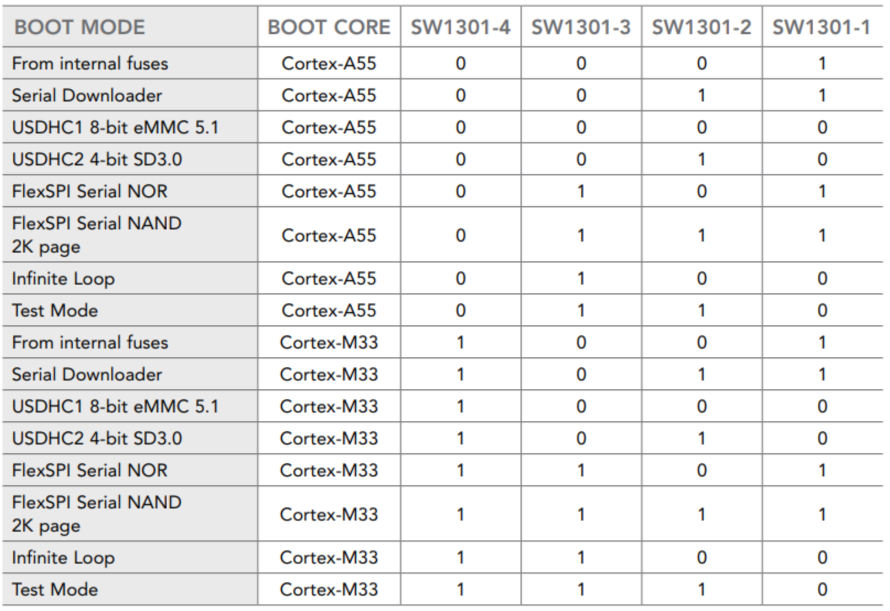
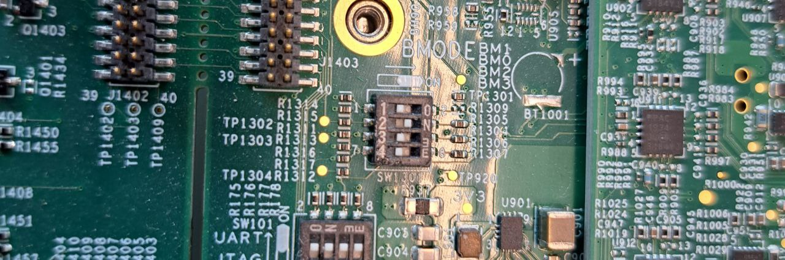
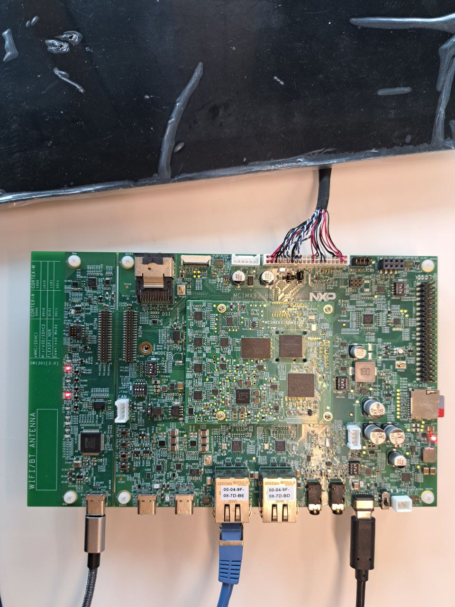

# imx93


## Yocto build image

Find the complete documentation [here](https://www.nxp.com/docs/en/user-guide/IMX_YOCTO_PROJECT_USERS_GUIDE.pdf)

- Required packages to install on host:
  ```bash
  sudo apt install gawk wget git diffstat unzip texinfo gcc build-essential chrpath socat cpio python3 python3-pip python3-pexpec xz-utils debianutils iputils-ping python3-git python3-jinja2 python3-subunit zstd liblz4-tool file locales libacl1
  ```

- (optional) If you already have the "repo utility", skip this step.
  ```bash
  mkdir ~/bin # this step may not be needed if the bin folder already exists
  curl https://storage.googleapis.com/git-repo-downloads/repo > ~/bin/repo
  chmod a+x ~/bin/repo
  ```

  Then add the bin folder created to the path
  ```bash
  # Add the following line in the ~/.bashrc file
  export PATH=~/bin:$PATH
  ```

- Now setup the yocto project
  ```bash
  mkdir imx-yocto-bsp
  cd imx-yocto-bsp
  repo init -u https://github.com/nxp-imx/imx-manifest -b imx-linux-scarthgap -m imx-6.6.23-2.0.0.xml
  repo sync
  ```

- Build the image
  ```bash
  # Use the script to setup the build folder and modify the conf files
  DISTRO=fsl-imx-wayland MACHINE=imx93-11x11-lpddr4x-evk source imx-setup-release.sh -b build-media
  # Build the image
  bitbake imx-image-multimedia
  ```

- Copy the image on the SD card:
  ```bash
  zstdcat imx-image-multimedia-imx93-11x11-lpddr4x-evk.rootfs-20240918104911.wic.zst | sudo dd of=/dev/sda bs=1M conv=fsync status=progress
  ```

  

## Pre-built images

The board comes supplied with an image on the EMMC. First we replicate this setup on the SD card: 

- Download the pre-built images and binaries here :
  https://www.nxp.com/design/design-center/software/embedded-software/i-mx-software/embedded-linux-for-i-mx-applications-processors:IMXLINUX
  Choose the linux version and download the image for i.MX 93 EVK

- Then unzip the content and flash the image (.wic) ont the SD card
  Before flashing on the SD, check with lsblk where the SD card was mounted

  ```bash
  # Replace of=/dev/sda with the correct mounted name
  sudo dd if=tisdk-default-image-am62pxx-evm.rootfs_v2.wic of=/dev/sda bs=4M status=progress
  ```

- The SD card has no w 2 partitions, boot and rootfs. Now copy the bootloader binary that should be launched on the board in the /boot partition. The bootloader binary is located in the folder, next to the ".wic" file.


## Use the correct dtb

Mount the image and on the boot partition, use the dtb called "imx93-11x11-evk-boe-wxga-lvds-panel.dtb"

```bash
# cd into the boot partition of the SD card mounted and do the following command
cp imx93-11x11-evk-boe-wxga-lvds-panel.dtb imx93-11x11-evk.dtb
```

You also can do this step with the file manager.


## HW setup

- To ensure the board will boot from the SD card, follow the booting switch table: 

  

  The i.MX93 used has a Cortex-A55 (use SW 4-1[0010]): 

  

- Board setup:
  <p align="center"></p>

  - Connect the screen
  - Connect RJ45 on any ethernet port
  - Connect USB-C power (black)
  - (Optional) Connect USB-C debug (gray)

The board should boot and the screen should display something.


## Connect to the board

### Serial

If the USB-C debug was connected, use Picocom (or Minicom) to connect to the UART: 
```bash
## From the host computer
sudo picocom -b 115200 /dev/ttyUSB2
```

If it is not USB2, find which one is the correct one.


### SSH

Find the ip of the board (needs to be on the same network)

```bash
## Install nmap if it is not yet on your system
sudo apt install nmap
## Find the IP of the board. You need to know your ip (ifconfig or ip a)
## YOUR_IP should be built like this :
## If the ip is 192.168.1.86, then you should have 192.168.1.0/24
nmap -sn <YOUR_IP>.0/24 | grep imx93-11x11-lpddr4x-evk  
```

SSH on the board: 

```bash
ssh root@<BOARD_IP>
```

